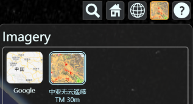
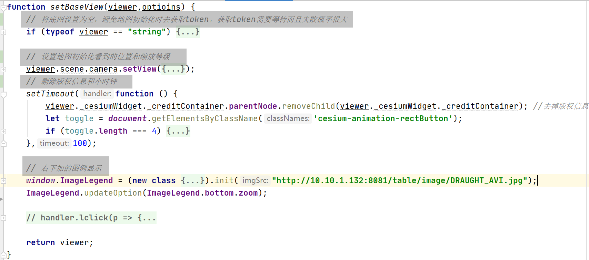
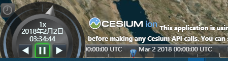
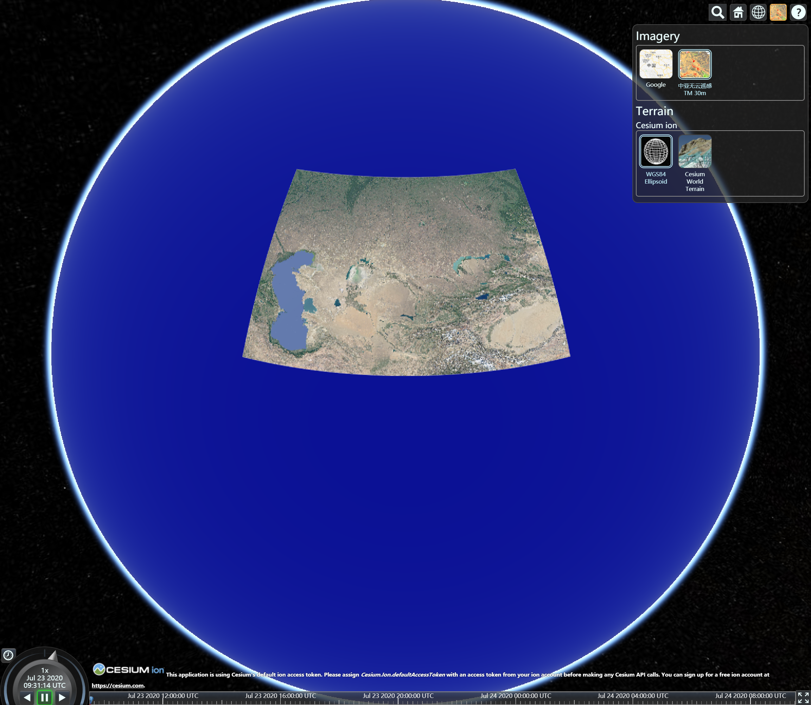
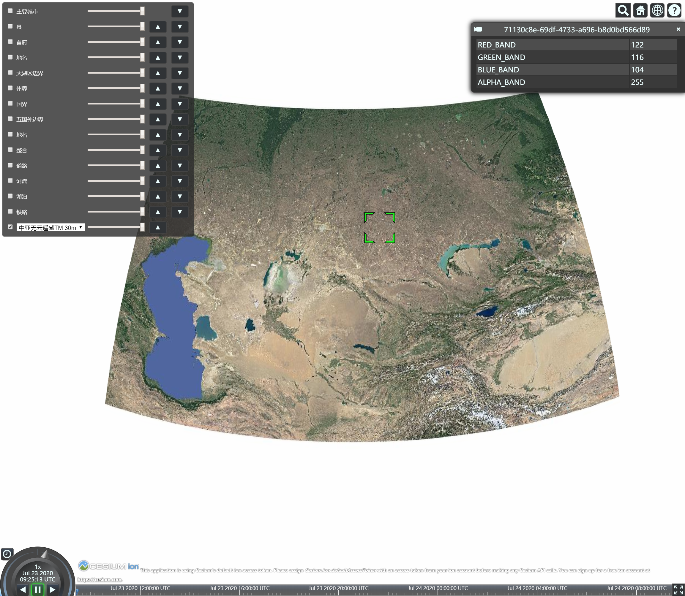
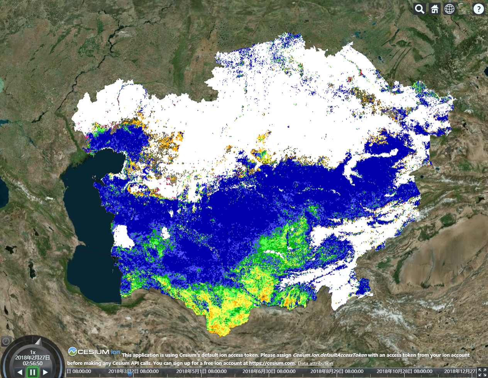
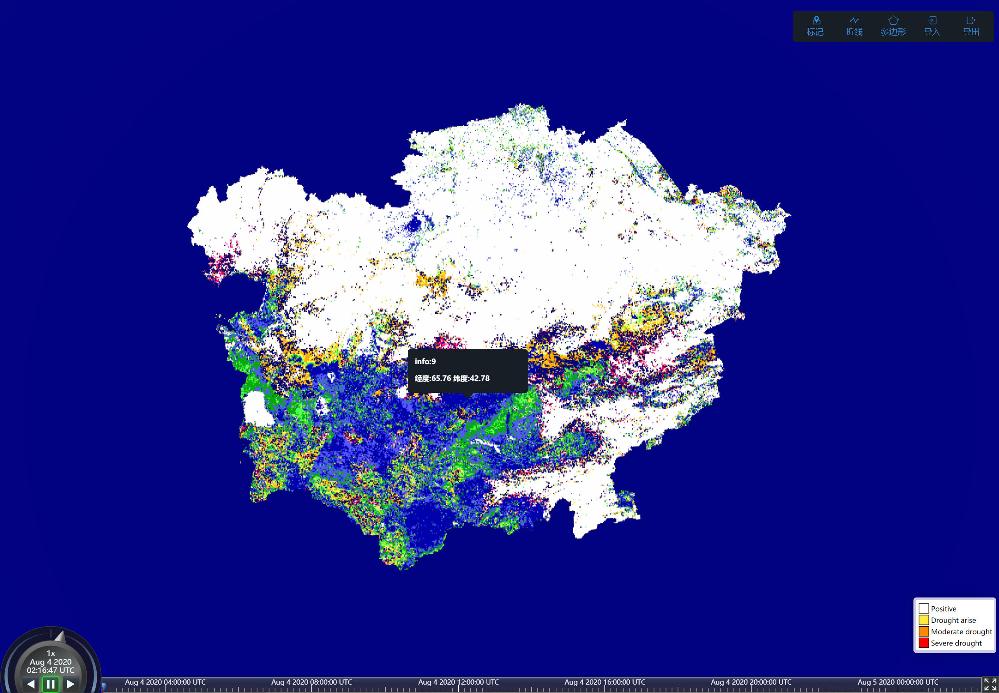
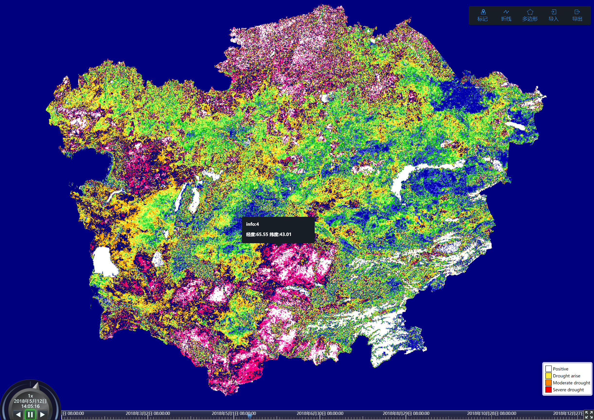

# cesium

该项目使用的是 cesium 1.71 版本

## 第一部分: src 文件夹中的文件说明

### 一、 📂 MarkerAndGraphicManager

使用方法如下
```html
<script src="srcPath/MarkerAndGraphicManager/index.js"></script>
<script>
    // 请记住👇这个 mgm 对象
    window.mgm = installMarkerAndGraphicManager().init(function () {
        // todo mgm.xxx
    },viewer);
</script>
```

上面代码中 ```mgm``` 对象的成员如下

|对象成员|说明|
|----|----|
|init|初始化方法，需要在回调函数中定义后续动作（用法如上👆）|
|panel|右上角的控制面板|
|getManager|获取管理器|
|flash|提供矢量闪烁方法|
|addMarker|添加标记|
|addPoPanel|添加 pop 弹出方法|
|addOWS|添加 geoServer 提供的 GeoJson|

- panel 成员


核心代码编写在 MarkerAndGraphicManager/MarkerControlPanel.js 文件中，在 index.js 文件的 init 函数中创建了实例

核心方法是 updateOption ，用于修改显示位置

```todo``` 另外右上角的功能中，如果有不需要的，或者需要自定义的可以直接修改源码，这部分后期有机会再完成

- getManager 是一个方法

调用将返回一个对象 ```{MarkManager,GraphicManager}```，这个对象中的两个成员是分别复制管理 标记(Marker) 和 折线与面(Graphic)

> ```GraphicManager``` 部分方法说明

|方法|说明|
|----|----|
|addPolyline|通过若干个点添加一个线|
|addPolygon|通过若干个点添加一个面|
|createPolyline|创建一个线(交互方式)|
|createPolygon|创建一个面(交互方式)|
|export|导出所有的面或线|
|import|挨个导入矢量要素|

```javascript
// addPolyline 和 addPolygon 使用方法相似
// 注意，面的几个点不需要是闭合的
// 例如 [{lat:1,lng:1},{lat:2,lng:2},{lat:2,lng:3}]
// 这里不需要在最后再添加一个 {lat:1,lng:1}
addPolygon([{lat,lng},{lat,lng},{lat,lng},],"名字",{
    properties: {
        objectId: 1,
        area: 12
    },
    defaultStyle: {
        material: new Cesium.Color.fromCssColorString('rgba(247,224,32,0.5)'),
        outline: true,
        outlineColor: new Cesium.Color.fromCssColorString('rgba(255,247,145,1)'),
        outlineWidth: 2,
        perPositionHeight: false
    }
});
addPolyline([{lat,lng},{lat,lng},{lat,lng},],"名字",{
    properties: {
        objectId: 1,
        area: 12
    },
    defaultStyle: {
        clampToGround: true,
        material: Cesium.Color.fromCssColorString('rgba(247,224,32,1)'),
        width: 3
    }
});
// 如果不想添加样式可以如下写法
addPolygon([{lat,lng},{lat,lng},{lat,lng},],"名字",{
    objectId: 1,
    area: 12
});
addPolyline([{lat,lng},{lat,lng},{lat,lng},],"名字",{
    objectId: 1,
    area: 12
});

// 参考 addPolyline 和 addPolygon 中对 import 的调用
import(feat)
// 如果 write = true，则将直接下载
'export(type,write)'
```

- addMarker 和 addPoPanel 方法

这两个方法是 MarkManager 中定义的方法，放出来是为了调用的方便，仅此而已

其中 addPoPanel 的 infos 参数只有第一个 key:value 会被显示到页面中

```javascript
window.mgm = installMarkerAndGraphicManager().init(function() {
    // name 和 tag 中有一个会被舍弃
    mgm.addPoPanel(p,{name: "haha","tag": "hehe"});
},viewer);
```

- addOWS 方法

这个方法可以将 geoJson 添加到地图中，并给定一定范围的自定义，使用方法如下

```javascript
window.mgm = installMarkerAndGraphicManager().init(function() {
    // type 只能是 line 或 polygon
    // flash 为 true 或 false
    // 两个 color 是 Cesium.Color 对象
    mgm.addOWS(url,type,flash,defaultColor,flashColor);
},viewer);
```

### 二、 📄 Basemap.js

⚠ 可以和下一个脚本对比区分



使用方法如下

```javascript
addBaseMap
    .addWMS(
        'http://10.10.1.132:8080/geoserver/ditu/wms',
        `ditu:google3857`,
        {
            service : 'WMS',
            transparent: true,
            format: 'image/png'
        },
        "中亚无云遥感TM 30m",
        "中亚无云遥感TM 30m",
        './../src/MySeal/images/vswi.jpg'
    )
    .addXYZ(
        'http://mt0.google.cn/vt/lyrs=m@160000000&hl=zh-CN&gl=CN&src=app&y={y}&x={x}&z={z}&s=Ga',
        'Google',
        'Google',
        './../src/MySeal/images/google.jpg'
    );
    var viewer = new Cesium.Viewer("cesiumContainer",{
        ...addBaseMap.output()
    });
```

### 三、 📄 BaseMapGroupManager.js


这个也是底图管理，但是和上面的区别是，这里的底图包含两部分，①必须显示的包裹整个地表的一张图层，②可选是否显示覆盖物图层

①例如：谷歌地图、百度地图、必应地图

②例如：铁路、水域、植被、地名

⚠ 如果想要和上一个模块一起使用，请自行完善修改代码，其中，在 ```BaseMapGroupManager.js``` 中，已经在 baseMapOptioin 中取消了 ```右上角 图层选择器```，需要自行传入参数打开

| 方法名 | 功能 |
| -------- | -------- |
| noBing | 不要必应地图 |
| addBaseLayerOption | 添加底图 |
| addBaseLayerOption | 添加底图 |
| addAdditionalLayerOption | 添加可选图层 |
| addBingAsDefault | 添加必应地图并设置为默认显示底图 |
| addWMS | 添加 wms 图层到 底图/可选图层 |
| addXYZ | 添加 xyz 图层到 底图/可选图层 |
| setDefaultBaseLayer | 设置默认显示底图 |
| apply | 完成操作后的默认调用方法 |

> noBing 表示不要显示 ```必应地图``` ，必须和添加 ```必应地图``` 操作选择一个使用，不然最后一个添加的自定义地图会被替换为 ```必应地图```

使用方法如下

```html
<body>
    <script src="srcPath/MySeal/BaseMapGroupManager.js"></script>
    <script>
        // 第一个参数是要将地图挂载到哪一个节点中，记住设置这个节点的大小
        // 第二个是可选参数，定义地图的 id 
        // 这个方法是事先封装的
        var bmgmc = new MyDefault_BaseMapGroupManager_Setting(document.body, 'cesiumContainer');
        
        // 如果需要自定义，请用以下方法
        var bmgmc = new BaseMapGroupManagerClass(document.body, 'cesiumContainer');
        bmgmc
        // .addXYZ(BaseMapGroupManagerClass.tarLayer.base, "Bing Maps Aerial", undefined)
        // .addBingAsDefault() // 与上一句同一个道理
        .noBing()
        .addXYZ(
            BaseMapGroupManagerClass.tarLayer.base,
            'Google',
            'http://mt0.google.cn/vt/lyrs=m@160000000&hl=zh-CN&gl=CN&src=app&y={y}&x={x}&z={z}&s=Ga'
        ).apply("Google");
    </script>
</body>
```

### 四、 📄 Navication.js

添加指南针和比例尺

### 五、 📄 setBaseView.js

这个脚本可以理解为提供了一些可有可无的基础操作，唯一有用的就是对外暴露一个 ```ImageLegend``` 对象



- ImageLegend 对象介绍

| 内容 | 说明 |
| -------- | -------- |
| updateOption(object) | 更新图片显示参数 |
| bottom | 提供图片显示参数中的 bottom |
| bottom.none | 没有时间轴时理想高度 |
| bottom.timeline | 只有时间轴时理想高度 |
| bottom.zoom | 有比例尺时理想高度 |
| option | 图片显示参数 |
| option.imageMaxWidth | 图片的最大宽度 |
| option.imageMaxHeight | 图片的最大高度 |
| option.bottom | 图片距离底部高度 |
| init(url) | 初始化和指定显示的图示 url |

```javascript
// updateOption 可以在任何时候调用
// init 随时可以调用来修改图片
ImageLegend.updateOption(ImageLegend.bottom.zoom)
.init("http://localhost:3000/images/a.jpg")
.updateOption({
    imageMaxWidth: "130px",
    imageMaxHeight: 0,
    bottom: 0
});
```

### 六、 📄 TimeLine.js

这个是时间线的修改，因为我的项目需要，我的需求是显示一年的数据，而一年每 8 天只有一期数据，并且通过 layers 参数来索引影像；这里有一个 bug 就是，时间条上的日期偶尔是中文偶尔是英文，不知道为什么



⚠ 注意代码中的最后一个参数中，return {layers,query_layers} 

```javascript
// m 年的第 n 期
// service: WMS
// layers: vhi_{m}_{n}
// styles: draught:vhi
// transparent: true
// format: image/png
// 使用方法如下
// 从 2018-01-01 到 2018-12-31
// 每 8 天一期
new TimeLine(viewer, '2018-01-01', '2018-12-31',
    'http://10.10.1.132:8080/geoserver/draught/wms', {
        styles: 'draught:vhi',
        service: 'WMS',
        transparent: true,
        format: 'image/png'
    },
    function ({
        year,
        month,
        day,
        dd // 对应闰年是 (1~366) 平年是 (1~365)
    }) {
        // 每 8 天一期，这里将天数对 8 求商取整
        // 如果有需要这里可以附加其他参数去覆盖例如 { layers,styles }
        return {
            // 因为这个 imageProvider 无法将 query_layers 进行设置，所以最好在这里设置好
            // query_layers: `vhi_${year}_${parseInt(dd / 8) + 1}`,
            layers: `vhi_${year}_${parseInt(dd / 8) + 1}`
        };
    }).init()
    .UTC(); // <- 这个是将日期变成中文，不需要可以不要
```


## 第二部分: example 文件夹下的例子

[BaseMap](./example/BaseMap.html)

```javascript
// <script src="../src/MySeal/Basemap.js"></script>
// <script src="../src/MySeal/setBaseView.js"></script>
var viewer = new Cesium.Viewer("cesiumContainer",{
    ...addBaseMap.output()
});
```



### 测试图层管理

[BaseMapGroupManager](./example/BaseMapGroupManagerTest.html)



### 测试时间线

[TimeLine](./example/TimeLine.html)



### 测试点击获取栅格信息

普通的 wms 点击事件 [ClickAndMark](./example/ClickAndMark.html)



结合时间轴的 wms 点击事件 [TimeLineWithClickPop](./example/TimeLineWithClickPop.html)



### 标记、折线、多边形

[MarkPolylinePolygon](./example/MarkerManager.html)


### 导航和比例尺

[navigation](./example/navigation.html)


### 疑难问题的解

> [关于时间轴修改时间的问题](https://github.com/CesiumGS/cesium/issues/3664)

> [图层选择面板](https://sandcastle.cesium.com/?src=Imagery%20Layers%20Manipulation.html&label=All)

> [图层导航](https://github.com/alberto-acevedo/cesium-navigation) [博文](http://cesium.xin/wordpress/archives/294.html)

> [点击事件](https://www.cnblogs.com/-llf/p/10431978.html)

> [坐标1](https://www.freesion.com/article/1630856380/) [坐标2](https://blog.csdn.net/qq_34149805/article/details/78393540)

> [多边形测量](https://github.com/xtfge/cesium-measure)

> [绘制多边形](https://github.com/Leaflet/Leaflet.draw)

> [geojson](https://www.cnblogs.com/shoufengwei/p/8883013.html)

### 其他

[入门文档](https://sogrey.top/Cesium-start/zh/guide/02-Viewer-some-helpful-widgets.html#%E6%9B%B4%E7%AE%80%E6%B4%81%E7%9A%84cesiumwidget)

[打包文档](http://mars3d.cn/forcesium/tutorials/cesium-and-webpack/index.html)

[颜色参考](https://cesium.com/docs/cesiumjs-ref-doc/Color.html?classFilter=color)

