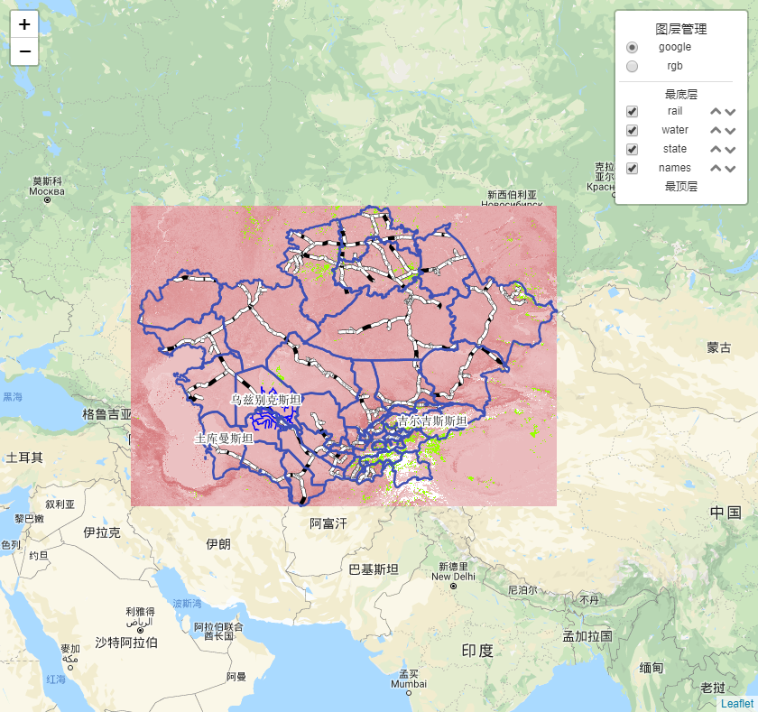
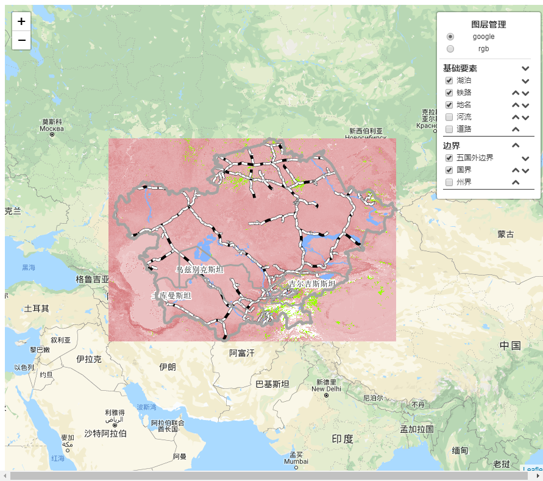

# 项目配置环境说明

- 1.[node](http://nodejs.cn/download/)

- 2.[vue/cli-service-global](https://cli.vuejs.org/zh/guide/prototyping.html)

# 运行测试样例

```cmd
npm i 或 cnpm i 或 yarn
vue serve Test\xxx.vue
```

# [运行效果视频](http://www.bilibili.com/video/av68282875)


# LeafletPlugin

> 1.leaflet-control-orderlayers-ibas



> 2.leaflet-control-orderlayer-ibas-group



