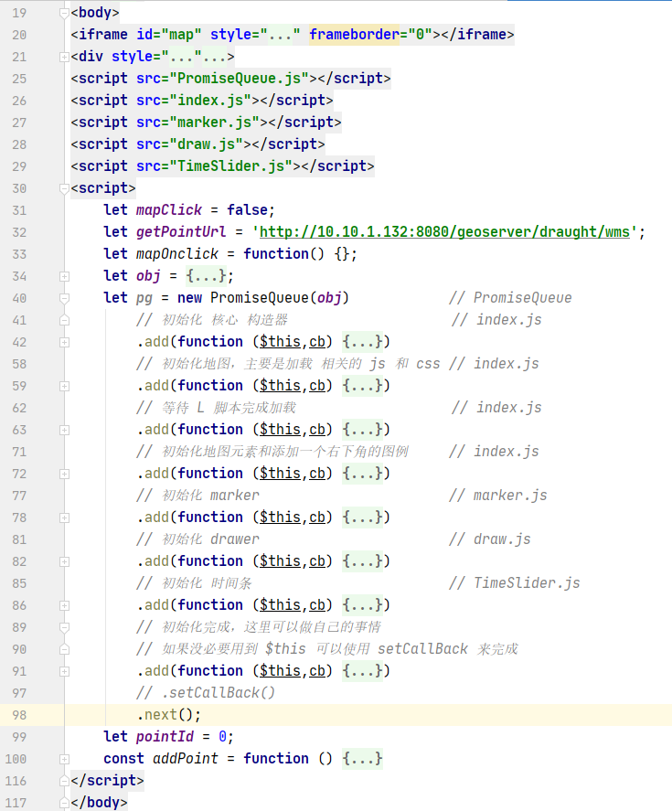
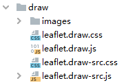
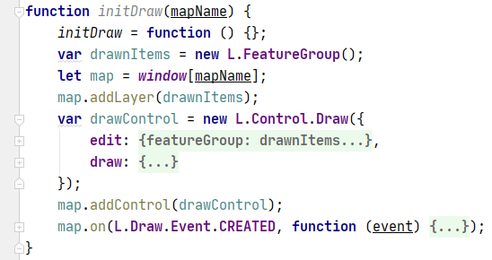
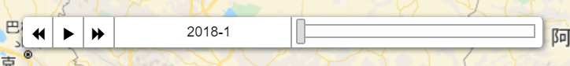

# 地图开发指南

如果下方文字难以理解可以看实际的例子，例子在 ```example-html```,
其中 [first.html](./example-html/first.html) 和 [second.html](./example-html/second.html) 是一样的，只是一个使用了 ```PromiseQueue```,
而 [geojsonOp.html](./example-html/geojsonOp.html) 是另外单独的例子

#### 1、基本html框架如下

- 注意，最新的版本支持 ```非 iframe```

```text
基础框架中仅仅包含以下内容
initFrameBase - 为 iframe 插入必要的 css 和 js 文件
    包含以下文件
    "/leaflet1.6/leaflet.css",
    "/leaflet1.6/plugin/ibasGroup/group.css",
    "/ips.js","/leaflet1.6/plugin/defaultAction.js" - 默认方法或复杂调用可以在这里完成调用底稿
    "/leaflet1.6/leaflet.js",
    "/leaflet1.6/plugin/ibasGroup/group.js",
    "/leaflet1.6/plugin/ibasGroup/group.js",
    "/leaflet1.6/plugin/ibasGroup/initGroup.js" - 本质上要放到 defaultAction 但是这个太复杂就单独放出来
    "/leaflet1.6/plugin/Utils/ShowOneLayer.js" - 这个可能会扩展，名字可能需要修改
    "/leaflet1.6/plugin/getInfo/GetRasterInfo.js" - 这个应该需要定制
insertDomToBody - 插入 dom 节点
insertJSandCSS - 插入 js 和 css 文件，包含回调
eval - 在 iframe 中执行指定代码
initMapDom - 初始化一个 地图 元素节点
managerMapGroup - 底图图层管理（需要修改）
showLegend - 在地图的右下角显示一张图片
showOneLayer - 显示一个图层
addMapOnClickToShowInfo - 为一个图层添加一个点击显示值的事件
```

> 这需要特别说明(index中定义了一个特别的方法```addListener```，和 defaultAction 中的 ```$emit```)

```js
// index.js
let addListener = function() {
    addListener = () => {};
    window.addEventListener('message', function (event) {
        if (typeof event.data === 'string' && event.data.startsWith("_map_")) {
            action(JSON.parse(event.data.substring(5)));
        }
    });
}

// defaultAction.js (向 top 发送消息，消息包括【消息msg】【消息来源target】【消息类型type】【其他内容others】)
// 例如 msg = { latlng:[1,1],target: 'map', type: 'click', other: { test:'测试' } }
// 这里假设是一个地图被点击事件
window.$emit = function(msg,target,type,others) {
    others = others || {};
    window.parent.postMessage("_map_" + JSON.stringify({
        data:msg,
        target,
        type,
        ...others
    }), '*');
}
```

> 完整代码

```html
<iframe src="" frameborder="0" style="width: 300px;height: 300px;"></iframe>
<!- 核心内容 -->
<script src="iframe/index.js"></script>
<script >

let theIfrInstance = ifrInstance("map",function (action) {
    // 触发事件，这里是实现和 iframe 交互的一个事件处理方法
    console.log(action);
});
// 上面是生成一个实例，这里是初始化 iframe，包括插入样式和完成js加载，以及定义一个 div#map 元素
theIfrInstance.initFrameBase(function/*初始化完成事件*/() {
    theIfrInstance.initMapDom(/*"map"*/); // 默认是 div#map
    theIfrInstance.showLegend("xxx.png"); // 这个是定义地图的右下角图例，例如色带
    // 插件初始化 <----
});

</script>
```

- ```非 iframe``` 的写法

```html
<html>
    <head></head>
    <body></body>
    <script src=".pathToSrc/plugin-js/PromiseQueue.js"></script>
    <script src=".pathToSrc/plugin-js/index.js"></script>
    <!- 下面是插件脚本 -->
    <script src=".pathToSrc/plugin-js/xxxx1.js"></script>
    <script src=".pathToSrc/plugin-js/xxxx2.js"></script>
    <script >
        ....
    </script>
</html>
```

> 鉴于插件接入会使代码非常杂乱，这里给定一个集合版本



---
#### 2、添加插件

```text
插件定义在 leaflet1.6\plugin 文件夹下，当前包含的插件有
draw、ibasGroup(未规范)、MyTimeSlider

插件使用定义在 iframe 目录下（使用的意思是在 top 执行对 iframe 操作，例如初始化，执行插件动作）

插件初始化使用套娃方法如下
plugin1 = plugin1Init(function() {
    plugin2 = plugin2Init(function(){
        plugin3 = plugin3Init(function(){
            ...
        });
    });
});
```

> 插件的使用定义规范如下

```js
const 创建名称 = function () {
    let init = false;
    let myMap = "";
    let evalFn = () => {};
    return {
        // theIfrInstance 主要是提供 必要 的 方法，例如 insertJSandCSS
        init(theIfrInstance,cb) {
            if (!init) {
                init = true;
                myMap = theIfrInstance.myMap();
                evalFn = theIfrInstance.eval.bind(theIfrInstance);

                theIfrInstance.insertJSandCSS(cb,[
                    "需要引入的 js（多个，请写多行）",
                    "需要引入的 js1",
                    "需要引入的 js2",
                    "需要引入的 css1",
                    "需要引入的 css2",
                ]);
            } else {
                cb();
            }
            return this;
        },
        // 这里开始编写其他关于该插件的方法
        // 例如 draw 需要初始化，可以定义初始化方法
        initDraw() {
            // FeatureGroup is to store editable layers
            evalFn(`initDraw("${myMap}")`);
            return this;
        },
        // 例如 marker 有 addMarker 方法
        addMarker({lat,lng}) {
            evalFn(`
                let marker = L.marker([${lat}, ${lng}]).addTo(window.${myMap});
            `)
        },
        // 当 方法 内容过于复杂时，使用 eval 方法会导致严重代码问题时，推荐使用 编写默认底稿 的方法
        // 例如 TimeSlider 的 刷新
        // 这个 defaultSetting 提供了 draught 的定义
        refreshTimeSlider(defaultSetting) {
            if (defaultSetting in settings) {
                // AddMyTimeSliderDraught 定义在 /leaflet1.6/plugin/MyTimeSlider/draught.setting.js
                evalFn(`AddMyTimeSliderDraught(${myMap});`);
            }
        }
    };
}
```

##### 2.1 以 draw 为例([这是官方编写的插件](https://github.com/Leaflet/Leaflet.draw))





```text
使用时，需要引入 leaflet.draw.js 和 leaflet.draw.css，使用方法具体参考官方

这里初始化代码如果通过 iframe.contentWindow.eval 发送给 iframe 完成难度太大
因此在 defaultAction 中定义了初始化方法，就是上面的 initDraw
```

> 注意 defaultAction 中 initDraw 对于图层的点击事件添加了触发方法

```js 
layer.on({
    click: function (e) {
        window.$emit({geoJson:layer.toGeoJSON()},'drawer','click');
    }
});
// todo 一下方法可以添加触发方法
map.on(L.Draw.Event.DELETESTART, function(event){
    showFlag.all = true;
    if(showFlag.flag){
        close();
    }
})
map.on(L.Draw.Event.DELETESTOP, function(event){
    showFlag.all = false;
})
map.on(L.Draw.Event.EDITSTOP, function(event){
    showFlag.all = false;
})
map.on(L.Draw.Event.DELETED, function(event){
    if(showFlag.flag){
        close();
        showFlag.all = false;
    }
})
```

> 将 draw 加入到地图中的具体方法

```html
<script src="iframe/draw.js"></script>

<script>
    // 拖拽组件实例【名称占用】
    let theDrawerInstance = null;
    // 在上面 插件初始化地方继续编写
    theDrawerInstance = draw().init(theIfrInstance,function () {
        theDrawerInstance.initDraw();
        // 可以继续初始化其他组件
    });
</script>
```

##### 2.2 以 TimeSlider 为例(这个组件以 [TimeDimension](https://github.com/socib/Leaflet.TimeDimension) 为基础进行重写的)

- 简单说明



```text
这个组件定义了三个简单的方法，【上一张】【播放/暂停】【下一张】

原理是 拼接 参数，参数大致如下，其中 layers 和 styles 是可变的
播放的时候就是通过修改 layers 和 styles 来完成获取影像的变化
{
    // "layers": "draught:vswi_2019_11",(这个会变化)
    // "styles": "draught:vswi",
    "service": "WMS",
    "request": "GetMap",
    "format": "image/png",
    "transparent": "true",
    "VERSION": "1.1.1",
    "srs": "EPSG",
}

因此插件需要四个核心参数
① url                   wms 服务的地址
② wmsOption             wms 请求参数，就像上面这个 对象
③ formParamFunction     用于动态获取 wms 参数中的 styles 和 layers
④ timeList              用于在显示当前的图像名称，并提供给 formParamFunction 以获取动态参数

例如
let timeListMap = {
    '2020-01': { layers: "pic-2020-01", styles: "pic:202001" },
    '2020-02': { layers: "pic-2020-02", styles: "pic:202002" }
};
let timeList = ['2020-01','2020-02'];
formParamFunction = function(time) {
    return timeListMap[time];
}
实际上 formParamFunction 可以返回很多参数
例如
formParamFunction = function(time) {
    // 多余的参数将覆盖 wmsOption 中对应的 键值
    return {
       "layers": "draught:vswi_" + time, //(这个会变化)
       "styles": "draught:vswi" + time,
       "service": "WMS",
       "request": "GetMap",
       "format": "image/jpeg",
       "transparent": "false",
       "VERSION": "1.1.1",
       "srs": "EPSG",
   };
}
```

> 使用定义如下

```js
const TimeSlider = function () {
    let init = false;
    let myMap = "";
    let evalFn = () => {};
    let settings = {
        // 这里可以定义一些 默认的设置（因为这里的参数是固定的，而且通过传参方式容易出错）
        draught: ["/leaflet1.6/plugin/MyTimeSlider/draught.setting.js",]
    };
    return {
        init(theIfrInstance,cb,defaultSetting) {
            let sets = [];
            if (defaultSetting && defaultSetting in settings) {
                sets = settings[defaultSetting];
            }
            if (!init) {
                init = true;
                myMap = theIfrInstance.myMap();
                evalFn = theIfrInstance.eval.bind(theIfrInstance);

                theIfrInstance.insertJSandCSS(cb,[
                    "/leaflet1.6/plugin/MyTimeSlider/index.js",
                    "/leaflet1.6/plugin/TimeDimension@1.1.1/leaflet.timedimension.control.min.css",
                    ...sets
                ].map(_ => './../../public' + _));
            } else {
                cb();
            }
            return this;
        },
        refreshTimeSliderPure(url,wmsOption,formParamFunction,timeList,timeout,from) {
            // FeatureGroup is to store editable layers
            evalFn(`AddMyTimeSlider(${myMap},"${url}",'${JSON.stringify(wmsOption)}','${formParamFunction.toString()}','${JSON.stringify(timeList)}',${timeout},${from})`);
            return this;
        },
        refreshTimeSlider(defaultSetting) {
            if (defaultSetting in settings) {
                evalFn(`AddMyTimeSliderDraught(${myMap});`);
            }
        }
    };
}
```

> 将 TimeSlider 加入到地图中

```html
<script src="iframe/TimeSlider.js"></script>
<script >
    // 可以在初始化里面
    TimeSliderInstance = TimeSlider().init(theIfrInstance,function () {
        TimeSliderInstance.refreshTimeSlider('draught');
    },'draught');
</script>
```


