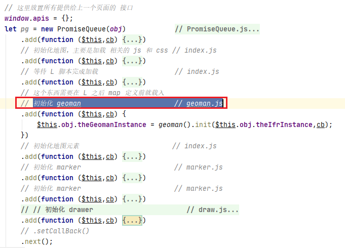

### 插件

1. 插件定义在 src/leaflet1.6/plugin 目录下，现有插件如下

- [draw](https://github.com/Leaflet/Leaflet.draw) 绘制工具

- getInfo 用于栅格图层点击位置的信息

```js
let gri = getRasterInfo().init(map);
// e 是点击地图的对象，可以只要点击对象中 latlng、layerPoint、containerPoint 
gri.getPointInfo("url","layername",e);
```

- Graphic 用于管理 geojson

```js
window.geoJsonManager = new GeoJsonManager(window[mapName],function (geojson) {
    // geojson 是 Graphic 中的 GeoJson 对象
    // do something
});
```

- [ibasGroup 图层管理](./20200721/README.md)

- [leaflet-geoman](https://github.com/geoman-io/leaflet-geoman)

- MyTimeSlider 简易时间轴

使用这个插件记得设置图层的 zIndex

```js
// 参见 src/leaflet1.6/plugin/MTimeSlider/draught.setting.js 的写法
wmsOptions = {
    // "layers": "draught:vswi_2019_11",(这个会变化)
    "styles": "draught:vswi",
    "service": "WMS",
    "request": "GetMap",
    "format": "image/png",
    "transparent": "true",
    "VERSION": "1.1.1",
    "srs": "EPSG",
    zIndex: 10,  // <- 就是这个东西
}
```

- [TimeDimension@1.1.1](https://github.com/socib/Leaflet.TimeDimension) 时间轴

2. 插件初始化脚本编写在 src/leaflet1.6/plugin/defaultAction.js 中

- 这里定义的方法基本都在 src/plugin-js 中用到了

3. 插件注入相关脚本在 src/plugin-js 中

- 除了 ```PromiseQueue.js``` 和 ```index.js``` 外，都是插件的初始化脚本，脚本格式如下

```js
const xxx = function () {
    let init = false;
    let myMap = "";
    let evalFn = () => {};
    return {
        init(theIfrInstance,cb) {
            if (!init) {
                init = true;
                myMap = theIfrInstance.myMap();
                evalFn = theIfrInstance.eval.bind(theIfrInstance);

                theIfrInstance.insertJSandCSS(cb,[
                    // "/leaflet1.6/....",
                    // 这里编写脚本的路径
                ].map(_ => (window.relativePath || "") + _));
            } else {
                cb();
            }
            return this;
        },
        initXXXX() {
            // FeatureGroup is to store editable layers
            // 有的插件可能不需要这部分
            // 但是如果需要，请将复杂的代码编写到
            // src/leaflet1.6/plugin/defaultAction.js
            evalFn(`initXXXX("${myMap}")`);
            return this;
        }
    };
}
```

4. 其他说明

- geoman 需要在 map 定义前插入，我不懂，反正就这样


